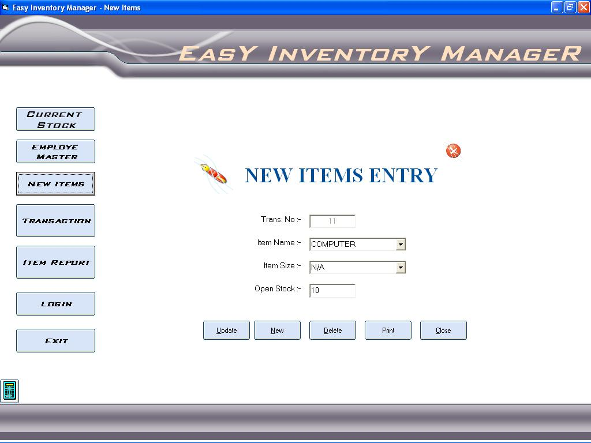

## easy inventory manager

### Description

if is easy code and interface to inventory control
 
### More Info
 
input item,custome etc names

fist see the database path

no side effect , just see the path of database

             |
---                |---
**Submitted On**   |2009-10-16 18:15:46
**By**             |[ravi vaghela](https://github.com/Planet-Source-Code/PSCIndex/blob/master/ByAuthor/ravi-vaghela.md)
**Level**          |Intermediate
**User Rating**    |4.0 (8 globes from 2 users)
**Compatibility**  |VB 6\.0, VBA MS Access
**Category**       |[Complete Applications](https://github.com/Planet-Source-Code/PSCIndex/blob/master/ByCategory/complete-applications__1-27.md)
**World**          |[Visual Basic](https://github.com/Planet-Source-Code/PSCIndex/blob/master/ByWorld/visual-basic.md)
**Archive File**   |[easy\_inven217415232010\.zip](https://github.com/Planet-Source-Code/ravi-vaghela-easy-inventory-manager__1-72886/archive/master.zip)

